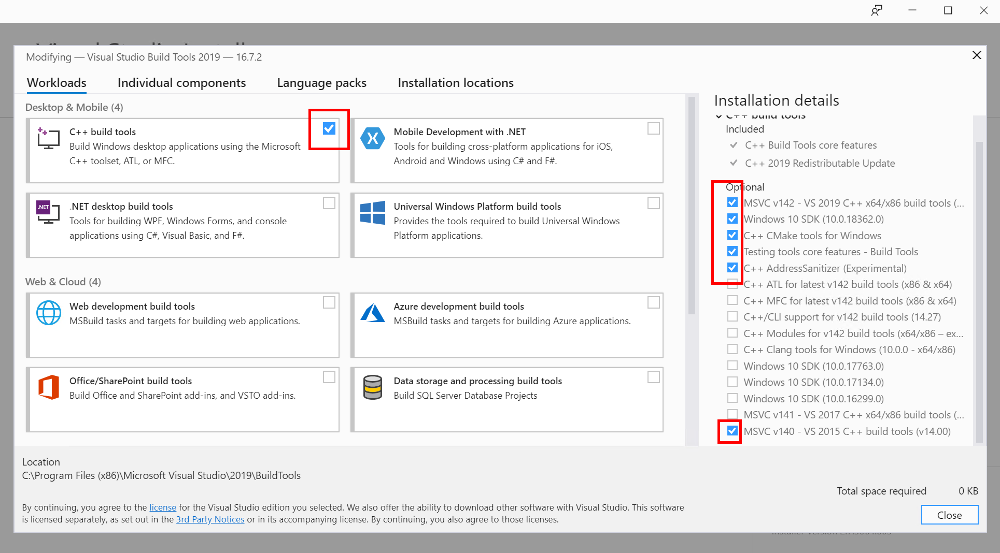

# THIS REPO AND README IS STILL UNDER HEAVY DEVELOPMENT!

# About this repo
This repo runs live here:  
https://share.streamlit.io/marckletz/omr-measurerecognition/Python/streamlit_app.py

## Faster R-CNN with ResNet-50 backbone
|   Model Name        					     |   Iterations  |   mAP    |   AP75   |   AP50   | system measures mAP |  staves mAP   |  stave measures mAP   |
|:------------------------------------------:|:-------------:|:--------:|:--------:|:--------:|:-------------------:|:-------------:|:---------------------:|
|   System measures   					     |     16500     |  96.547  |  98.935  |  98.970  |        XX           |      XX       |           XX          |
|   Stave measures    					     |     16200     |  88.168  |  96.860  |  98.013  |        XX           |      XX       |           XX          |
|      Staves         					     |     10800     |  93.596  |  98.987  |  100.00  |        XX           |      XX       |           XX          |
| System measures and Staves                 |     15000     |  90.792  |  96.481  |  96.500  |       95.532        |    86.053     |           XX          |
| System measures, Stave measures and Staves |     4500      |  77.779  |  86.884  |  87.404  |       90.010        |    78.622     |         64.706        |


## Faster R-CNN with ResNet-101 backbone
|   Model Name        					     |   Iterations  |   mAP    |   AP75   |   AP50   | system measures mAP |  staves mAP   |  stave measures mAP   |
|:------------------------------------------:|:-------------:|:--------:|:--------:|:--------:|:-------------------:|:-------------:|:---------------------:|
|   System measures   					     |     19500     |  97.112  |  98.928  |  98.949  |        XX           |      XX       |           XX          |
|   Stave measures    					     |     17100     |  89.254  |  97.903  |  98.018  |        XX           |      XX       |           XX          |
|      Staves         					     |     18000     |  94.004  |  99.010  |  100.00  |        XX           |      XX       |           XX          |
| System measures and Staves                 |     18300     |  91.301  |  96.478  |  96.498  |       95.768        |    86.834     |           XX          |
| System measures, Stave measures and Staves |     2700      |  77.829  |  88.697  |  89.366  |       85.383        |    79.779     |         68.324        |


## Faster R-CNN with ResNeXt-101-32x8d backbone
|   Model Name        					     |   Iterations  |   mAP    |   AP75   |   AP50   | system measures mAP |  staves mAP   |  stave measures mAP   |
|:------------------------------------------:|:-------------:|:--------:|:--------:|:--------:|:-------------------:|:-------------:|:---------------------:|
|   System measures   					     |     18600     |  96.931  |  98.909  |  98.943  |        XX           |      XX       |           XX          |
|   Stave measures    					     |     18300     |  89.360  |  97.867  |  98.020  |        XX           |      XX       |           XX          |
|      Staves         					     |     9900      |  94.255  |  100.00  |  100.00  |        XX           |      XX       |           XX          |
| System measures and Staves                 |     20000     |  90.880  |  95.981  |  96.006  |       96.732        |    85.028     |           XX          |
| System measures, Stave measures and Staves |     4200      |  76.778  |  86.219  |  86.754  |       85.278        |    72.417     |         72.638        |


# Installation Setup

Requirements before starting:  
Python >= 3.6  
to run training and testing you need a CUDA capable device and the CUDA Toolkit 10.1  
you can run the streamlit app which does inference without CUDA

## For Linux:

Step 1:  
You will require some build / development tools, install them by running:  
```
sudo yum groupinstall "Development Tools"
or
sudo apt-get install build-essential
```

Step 2:  
Install python development version.  
```
sudo yum install python36-devel
or
sudo apt-get install python3-dev
```

Step 3 (OS DEPENDENT):  
**CentOS, Amazon Linux AMI, Red Hat Enterprise Linux:**  
Needs cython before running the requirements install:  
```pip3 install cython```  
This is needed for pycocotools because pip apparently builds all packages first, before attempting to install them.  
(ﾉ☉ヮ⚆)ﾉ ┻━┻

**Ubuntu:**  
There are no wheels available for opencv-python-headless on some ubuntu distributions.  
Instead of building it on your own, I recommend to install it with the following command.  
```sudo apt install python3-opencv```  
Dont forget to remove the opencv-python-headless requirement from the linux_requirements.txt if you did this!  

**Debian:**
Skip to Step 4  

Step 4:  
install all the required python libraries from this repository:  
```sudo pip3 install -r requirements.txt [-v]```
This might take a while! So be patient, you may add the -v tag to see installation progress.  

## For Windows:

Requirements:  
Windows SDK  
C++14.0 build tools  
Microsoft Visual C++ Redistributable  
can all be installed with the Visual Studio installer.  
https://visualstudio.microsoft.com/thank-you-downloading-visual-studio/?sku=BuildTools&rel=16  


Step 1:  
install all the required python libraries from the OMR-MeasureRecognition repo.  
```pip install -r windows_requirements.txt```

Step 2:  
manually install detectron2 because there is no windows support, we need to pull and install from source  
```
git clone https://github.com/facebookresearch/detectron2.git
cd detectron2
git reset --hard 0130967d72346c520c9508620a6833fcef135cee # to pull the exact detectron version 0.2.1
```

Step 3:  
now you can install detectron2 with:  
```python setup.py install```
Requires admin privileges, so run cmd as admin!

Possible step 4:  
If step 3 fails with an error message about an nms_rotated_cuda.cu file, try this.  
add the following line in detectron2\detectron2\layers\csrc\nms_rotated\nms_rotated_cuda.cu before #ifdef WITH_HIP:  
#define WITH_HIP  
Repead step 3.


# Run the Streamlit app:
Make sure that the python package installation location is added to path, so that you can run streamlit. If the streamlit command fails with "command not found" you will need to add the following to your path:  
```export PATH="$HOME/.local/bin:$PATH"```

Complete the installation instructions and then run:  
```streamlit run Python/streamlit_app.py```  
from the OMR-MeasureRecognition repository